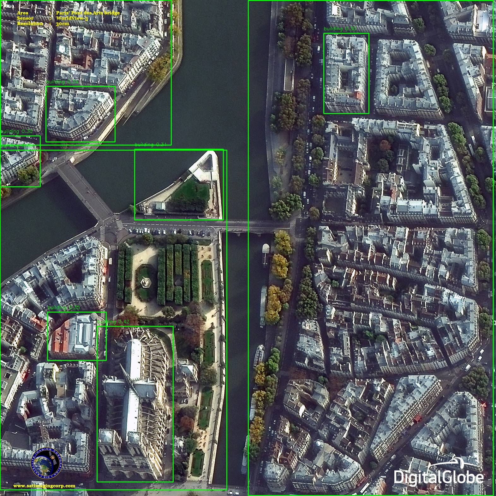
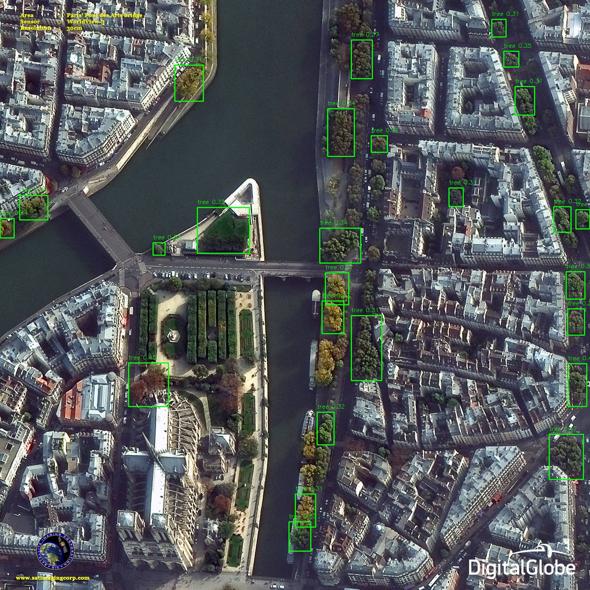

## What is this?

- This was a test to see if the quantized groundingdino model see: [`saburq/groundingdeno_model_quant_int8`](https://huggingface.co/saburq/groundingdeno_model_quant_int8) works. 


- Now moved to offical version: [`onnx-community/grounding-dino-tiny-ONNX`](https://huggingface.co/onnx-community/grounding-dino-tiny-ONNX)

## Usage

Install grounding-dino version of transformers.js
```bash
git clone git@github.com:decision-labs/test-groundingdino-quantized-js.git
cd test-groundingdino-quantized-js
git clone git@github.com:huggingface/transformers.js.git
cd transformers.js
git checkout add-grounding-dino
npm run build
cd ..
```

Install dependencies.
>**Make sure you are in the root of the repo.**
```bash
yarn install
```

Run server
```bash
npx nodemon app.js
```

Run client
```bash
python draw_boxes.py
open output_with_boxes.png
```



## Trying new labels

In `draw_boxes.py` change the `text` to another label like `"tree"`.


## Example API

```bash
http://localhost:3000?model_name=object-detection&text=tree&image_uri=https://content.satimagingcorp.com/static/galleryimages/Satellite-Image-Paris-Pont-des-Arts-bridge.jpg
```